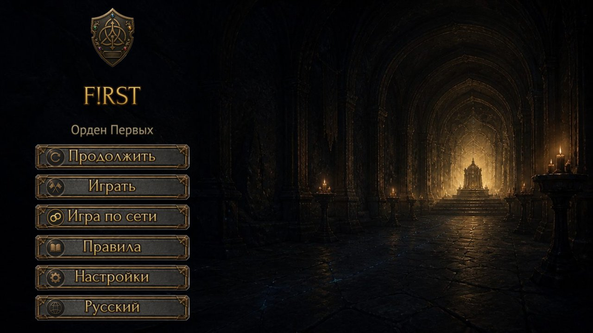
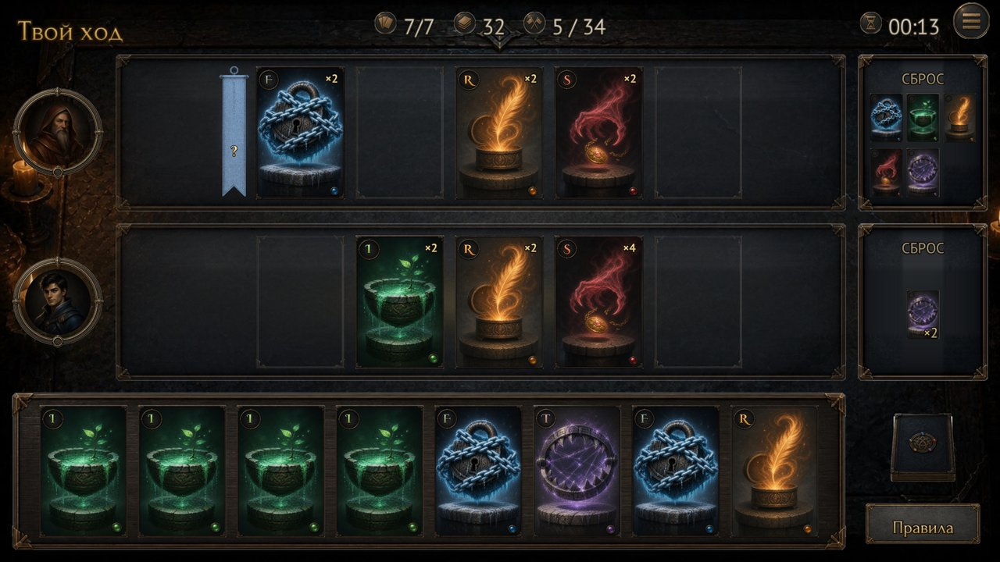
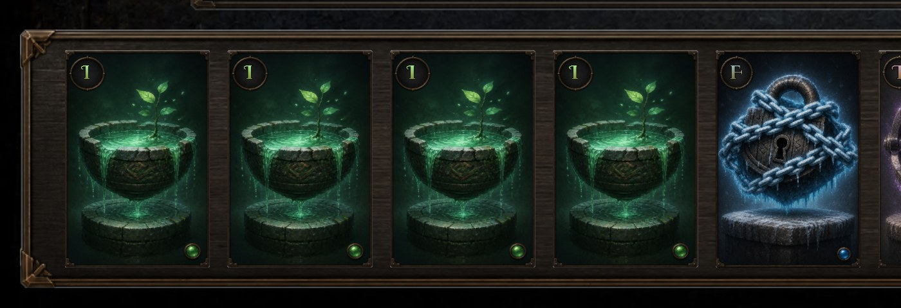

# F!RST · Лаборатория · E0 Направление
> Раунд 4, финал E0. Мир — «гик-берлога», игроки — миниатюры на жетонах, камера сверху. Здесь якорь стиля A1 и первый статичный тизер того, как эффекты выглядят предметами на столе.

## intro
**Точка А — как игра выглядит сейчас.** Тёмный стол, серые панели, буква спрятана в медальон в углу карты, ничего не движется, пока игрок думает. Полный аудит — в `audit/README.md`.

  

**Вердикт судьи по раунду 1 (18.08).** D1 Таверна — 2·1·2·2, нравится стиль, пугает похожесть на существующее. D2 Типограф — 2·1·2·1, читаемость хорошая, но слишком реалистично. D3 Мультяшный — 2·2·1·1, читаемо и лаконично, но дёшево и как копия мобильных игр. D4 Таро — 0·1·0·0, темно, линии не читаются. Ни один мир не принят целиком; принята **подача D1** — живопись, тёплый свет, толстые формы.

**Новый лор от автора.** Игра родилась в перерывах между длинными партиями в MTG — как быстрая простая игра «между делом». Поэтому мир — не выдуманная вселенная, а **реальный стол настольщика**: карты ККИ, кубики, фигурки, коробки колод, коврик — гиковская атмосфера в фэнтези-сеттинге. Отсылки, не копии брендов.

**Вердикт по раунду 2 (18.08).** D5a Кухня — 2·2·2·2, нравится антураж и стиль карт; D5b Клуб — 1·2·2·2, окружение отличное, «хочется анимировать»; D5c Таверна+гик — 1·2·1·0, портреты в стол вписаны как часть дизайна, но таверна — уже Hearthstone. В D5a и D5b иконки персонажей — инородные. **Принято:** мир D5a + жизнь окружения D5b (дом, а не магазин: полки с настолками за спиной) + портреты как физические предметы на столе, как в D5c.

**Вердикт по раунду 3 (18.08).** P1 Рамки — 1·1·2·2, рамки не нравятся. P2 Миниатюры — 1·2·2·2, «очень нравятся статуэтки», но не решить между ними и жетонами; делать крупнее. P3 Жетоны — 2·2·2·2, «жетоны классные». В P2 и P3 карты противника под углом читаются плохо. Вопрос судьи: как будут выглядеть применённые эффекты (F, сброс)?

**Решения арт-директора → раунд 4.** Миниатюра **на** жетоне-подставке (гибрид P2+P3, крупнее). Камера — почти строго сверху, ряды равновелики, карты противника «лицом к игроку». «Популярные герои» — как архетипы, не копии. Эффекты — **предметы на столе**: F — замок-жетон на слоте, T — капкан-жетон под рукой, S — карту утаскивают в лоток, R — карта поднимается из лотка, I — добор со «шлепком». Сброс — деревянный лоток.

**Принципы, по которым судим** (0–2 балла каждый): П1 буква — герой · П2 хочется, чтобы это двигалось · П4 уют, где остался бы вечером · П5 один мир для меню, стола, карт и кнопок. П3 (действие объясняет себя) в статике не проверяется — это E4.

## D1 · Светлое фэнтези-таверна
thesis: Тот же мир Ордена Первых, но с светом и игривостью Hearthstone: мёд, свечи, толстые формы, дружелюбие.
refs: Hearthstone (стол, освещение, «толстые» формы), Legends of Runeterra (спокойная живопись), Gwent (живописность)
note: Тёплая, дружелюбная, ближе всего к текущему арту — лечит главную болезнь (свет) без смены вселенной. Буквы читаются, но остаются свечением поверх картинки, а не предметом; вокруг много бытового шума (кружки, кот, лампа) — уютно, но на телефоне это шум. Риск: «ещё один Hearthstone». Мои баллы: П1 1 · П2 2 · П4 2 · П5 2.

## D2 · Кабинет типографа
thesis: Буквы — физические литеры на картоне, эмблемы школ — сургучные печати, стол — рабочее место мастера при лампе. Игра про то, кто первым наберёт слово.
refs: Inscryption (интимность стола и лампы, без хоррора), Pentiment и Inkulinati (рукопись, буквица), Book of Hours (уют кабинета), letterpress-типографика
note: Единственное направление, где буква — предмет, а не декор. Эмблема ушла в печать — готовая система иконок школ; каждый предмет на столе может стать UI: лоток — сброс, лампа — живой свет, реагирующий на события, чернильница — таймер. Лор рождается сам. Уют максимальный. Слабые места: рендер ушёл в фотореализм — вернуть в живопись; школы различаются только цветом буквы — эффектам придётся быть ярче стола. Мои баллы: П1 2 · П2 2 · П4 2 · П5 2.

## D3 · Яркий мультяшный настольный
thesis: Толстый контур, cel-shading, гигантская буква — максимальная читаемость на телефоне, весело и легко.
refs: Wildfrost, Marvel Snap, Cult of the Lamb, Slay the Spire 2, Kingdom Rush; по движению — Balatro
note: Лучшая читаемость и самый «живой» даже в статике — толстые формы просятся в упругую анимацию. Но это полный отказ от текущего арта, легко скатиться в безликую мобильную игру, истории и лора здесь меньше всего. Мои баллы: П1 2 · П2 2 · П4 1 · П5 1.

## D4 · Лавка таро
thesis: Тёмный уют: бархат, свечи, золотая фольга, буква как аркан.
refs: Cultist Simulator, Book of Hours, Balatro (карты таро), эстетика тарологических колод
note: Элегантно, буква читается, атмосфера есть — но это снова тёмный экран, где уют держится на трёх свечах; тонкая золотая линия пропадёт на телефоне; школы плохо различимы. Мои баллы: П1 2 · П2 1 · П4 1 · П5 2.

## D5a · Стол гика: кухня дома, вечер после большой партии
thesis: Домашний стол после долгой партии в ККИ: фэнтези-коврик, миниатюра на страже, чипсы, чай, кубики — и наша быстрая игра посередине.
refs: Настоящий стол на «пятничной Магии»; подача — Hearthstone (свет, толстые формы); композиция — Inscryption (интимность стола сверху)
note: Самый честный ответ на лор: это буквально «то, из чего игра родилась». Атрибутика читается с первого взгляда и рассказывает историю без слов. Слабое место — рисованный коврик под картами шумит и отнимает у карт контраст: в игре коврик придётся приглушить или сделать однотонным в зоне слотов. Персонажи-портреты в худи и наушниках — современные, это правильно для этого мира. Мои баллы: П1 2 · П2 2 (лампа, пар от чая, кубик, который можно крутить) · П4 2 · П5 2.

## D5b · Стол гика: игровой клуб / магазин настолок
thesis: Стол в клубе: чёрный неопреновый коврик, полки с коробками за спиной, стойка с бустерами, лист пар турнира.
refs: Локальный игровой магазин; подача — как в D1
note: Лучшая читаемость карт из всех девяти рендеров — кремовые карты на чёрном коврике. Фон клуба даёт «жизнь вокруг» (люди, лампы), это готовая идея для idle-движения фона. Но уюта чуть меньше, чем дома: публичное место, свет холоднее и рассеяннее. Мои баллы: П1 2 · П2 2 · П4 1 · П5 2.

## D5c · Стол гика в фэнтези-таверне (гибрид с D1)
thesis: Таверна из D1, но стол принадлежит гикам: коврик, фигурка у свечи, кубики, спин-даун, тарелка чипсов рядом с кружкой.
refs: D1 + гик-атрибутика
note: Самый тёплый и «дорогой» на вид; вариант #2 показал интересный ход — цветная подложка карты по школе с кремовой буквой (читается хуже, чем кремовая карта, но узнаваемее в стопке). Риск тот же, что у D1: похоже на существующее — атрибутика спасает лишь отчасти. Мои баллы: П1 2 · П2 2 · П4 2 · П5 1.

## P1 · Портреты — деревянные рамки, стоящие на столе
thesis: Две настольные фоторамки с портретами игроков на краю стола, с латунной табличкой.
refs: D5c (портреты в рамках как часть стола)
note: Спокойно, понятно, «домашне». Рамка — готовый UI-контейнер: в неё можно вписать имя, таймер, счётчик — и всё будет частью предмета. Из минусов: рамка статична по природе, живость придётся добавлять светом (лампа бликует на стекле, рамка чуть вздрагивает при ударе). Мои баллы: П1 2 · П2 1 · П4 2 · П5 2.

## P2 · Портреты — раскрашенные миниатюры игроков
thesis: Игроки стоят на коврике как две расписанные миниатюры на круглых подставках — карикатурные «мы».
refs: Настольные миниатюры; Warhammer-хобби как дух, без брендов
note: Самый гиковский и самый живой вариант: миниатюра — уже персонаж, ей естественно покачиваться, поворачиваться к активной зоне, вздрагивать от удара карты, подсвечиваться на своём ходу. Портрет перестаёт быть «иконкой» и становится жителем стола. Риск: на телефоне мелкая фигурка читается хуже круглого портрета — придётся дать ей крупный масштаб или подставку-ореол. Мои баллы: П1 2 · П2 2 · П4 2 · П5 2.

## P3 · Портреты — жетоны в карманах коврика
thesis: Толстые круглые картонные жетоны с портретами лежат в напечатанных на коврике круглых слотах.
refs: Жетоны игроков из настолок
note: Самый честный «настольный» ответ и самый читаемый на телефоне (круг с толстым цветным ободком). Но лежащий плашмя жетон визуально ближе всего к тем самым «иконкам», которые судья назвал инородными; спасает только ободок и печать слота. Живость — только вращение/подпрыгивание. Мои баллы: П1 2 · П2 1 · П4 2 · П5 1.

## A1 · Якорь стиля: финальный стол «гик-берлога»
thesis: Все решения E0 в одном кадре: камера сверху, спокойный коврик с рунным кантом, кремовые карты-литеры в протекторах, миниатюры на жетонах, лоток сброса, полки настолок за спиной, лампа.
refs: D5a (мир) + D5b (полки, жизнь окружения) + P2/P3 (игроки) + собственные решения по камере
note: Это и есть точка Б, к которой едем. Проверка на принципах: П1 — буквы читаются первыми в обоих рядах, наклон ушёл; П4 — лампа, кружка, чипсы, полки — уют без таверны; П5 — карты, жетоны, лоток, кубики сделаны из одного материала. Что ещё уточнять в следующих экспериментах: коврик — печатный ли кант или совсем гладкий (E3); размер миниатюр на 960×540 (E2); лоток сброса — справа снизу или справа под колодой (E6). Мои баллы: П1 2 · П2 2 · П4 2 · П5 2.

## FX · Тизер эффектов: запрет F и сброс
thesis: Крупный план двух моментов: на слот противника защёлкнут замок-жетон с инеем и вымпелом запрещённой буквы; карта S съезжает в деревянный лоток сброса с пылью.
refs: Настольные жетоны состояний; Hearthstone (эффект рождается из предмета, а не поверх)
note: Так выглядит правило «эффект — предмет»: замок можно физически поставить, вымпел — воткнуть, карту — смахнуть в лоток. Всё это анимируется руками-невидимками: предмет прилетает сверху, приземляется с микроударом, оставляет след (иней, пыль). Оговорка: это статика, движение и читаемость «что произошло» проверяем в E4 на незнакомце. Лишние буквы B/G в лотке — артефакт генерации. Мои баллы: П1 2 · П2 2 · П4 2 · П5 2.

## outro
**Итог E0 (на утверждение).** Якорь стиля — **A1**: гик-берлога ночью, лампа, полки настолок; камера сверху; тёмный спокойный коврик; кремовые карты-литеры в протекторах с гигантской рукописной буквой и дудл-эмблемой; игроки — миниатюры-архетипы на жетонах-подставках; сброс — лоток; эффекты — предметы на столе (FX). Если судья принимает A1 и принцип FX, E0 закрывается, а E1 «Живая карта» и E4 «Пять эффектов» делаются движущимися прототипами на этом столе.

Что для этого нужно от судьи: баллы по A1 и FX и ответ на один вопрос — **эффекты-предметы: да или нет?** Если «нет» — какие эффекты вы видите иначе (свет/магия поверх, как сейчас в игре)?

**Лист судьи**

| Направление | П1 буква | П2 движение | П4 уют | П5 один мир | Нравится / отталкивает |
|---|---|---|---|---|---|
| D1 Таверна | | | | | |
| D2 Типограф | | | | | |
| D3 Мультяшный | | | | | |
| D4 Таро | | | | | |
| D5a Кухня | | | | | |
| D5b Клуб | | | | | |
| D5c Таверна+гик | | | | | |
| P1 Рамки | | | | | |
| P2 Миниатюры | | | | | |
| P3 Жетоны | | | | | |
| A1 Якорь | | | | | |
| FX Эффекты-предметы | | | | | |

Гибрид допустим: «мир такой-то, свет такой-то, буква такая-то». Дальше по вердикту: E1 живая карта и E2 буква-герой делаются сразу в выбранном мире.
