# F!RST · Лаборатория · E2 Буква — герой
> Четыре компоновки лица карты. Смотреть не крупно, а в тестах: рука из 7 карт и стол при 960×540 — так карту увидит телефон.

## intro
**Гипотеза.** Буква должна читаться первой — раньше цвета, эмблемы и рамки — и оставаться читаемой в руке из 7 карт на маленьком экране и в стопке ×N. Все четыре варианта — один и тот же мир (кремовый картон, гуашь, цвета школ), различается только компоновка.

**Как смотреть.** Сначала — «рука из 7 · 960×540» и «стол · 960×540» у каждого варианта: это реальный масштаб телефона. Потом крупный лист — там видно качество, но им нельзя судить читаемость.

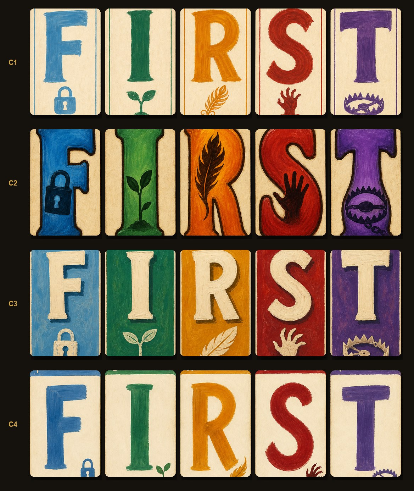

**Отдельное решение для судьи — как рисуется буква в игре.** Архитектурный принцип проекта: текст рендерится движком шрифтом, а не запекается в картинку (i18n, чёткость). Но буква на карте — не текст, а герой: пять рукописных гуашевых литер, одинаковых в RU и EN. Предложение: **буквы F I R S T запекаются в арт карты** (5 ассетов), а всё остальное — ×N, счётчики, подписи — по-прежнему шрифтом. Плата: буква не масштабируется бесконечно чётко (лечится размером исходника 1024×1536) и не перекрашивается на лету (не нужно).

## C1 · База: гигантская буква + дудл-эмблема внизу
thesis: То, что было в E1: кремовая карта, тонкий кант цвета школы, буква ~65 % высоты, маленькая эмблема под ней.
note: Спокойно, честно, «самодельно». Читается хорошо, но в руке из 7 при 960×540 буквы тонковаты — светлая гуашь на кремовом теряет контраст, особенно F и I. Эмблема на телефоне почти не видна (и не должна — она второстепенна). Мои баллы: П1 1.5 · П5 2.

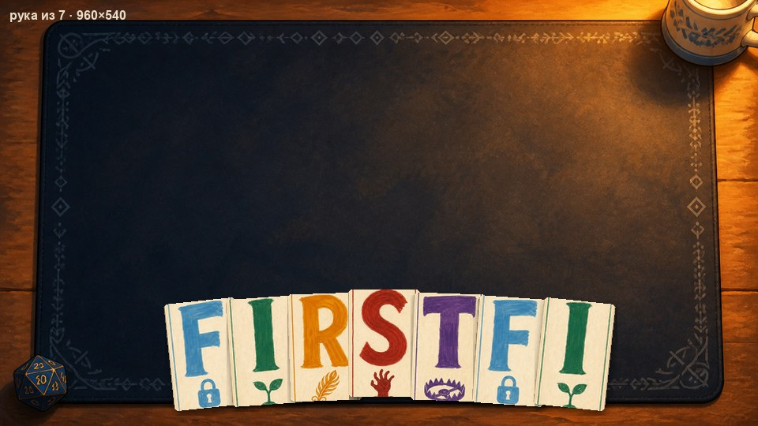 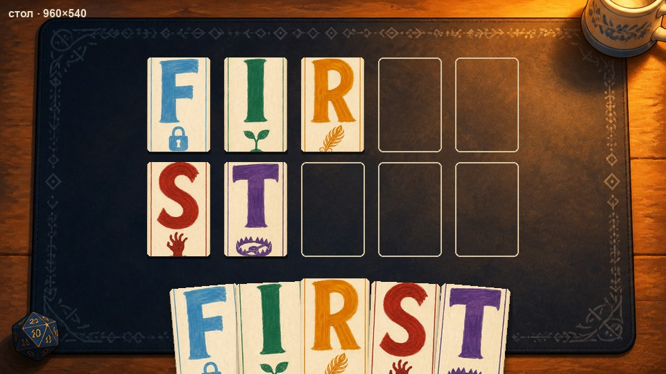 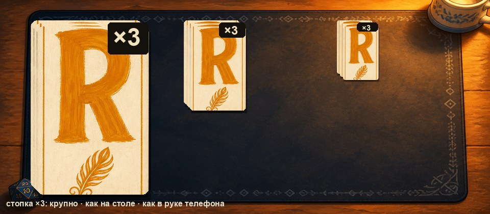

## C2 · Тяжёлая буква с тёмной обводкой, эмблема внутри
thesis: Буква ~75 % высоты, насыщенная гуашь, тёмная обводка, эмблема — силуэт внутри тела буквы.
note: Лучший результат в тестах на 960×540: буквы читаются с любого расстояния, школа узнаётся и по цвету, и по силуэту эмблемы. Плата — карта «громче» и менее нежная, чем C1; эмблема внутри буквы местами ломает её форму (R с пером). Это можно смягчить в финальной генерации: обводку тоньше, эмблему меньше. Мои баллы: П1 2 · П5 2.

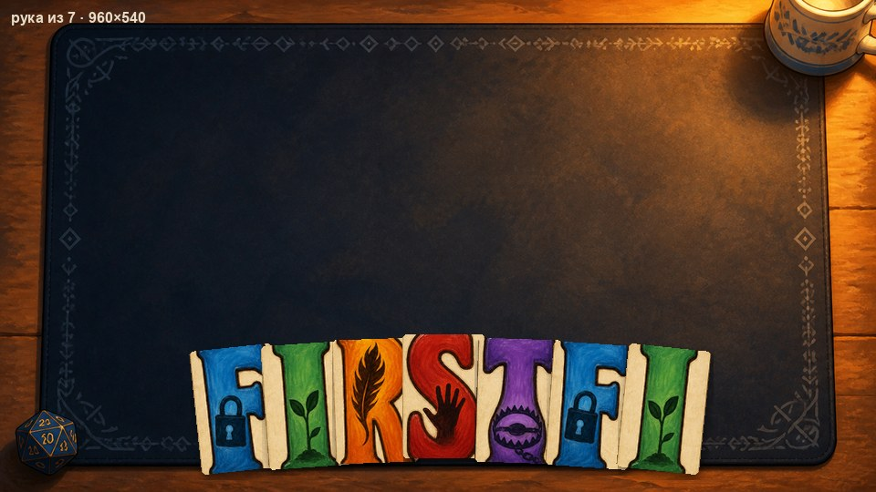 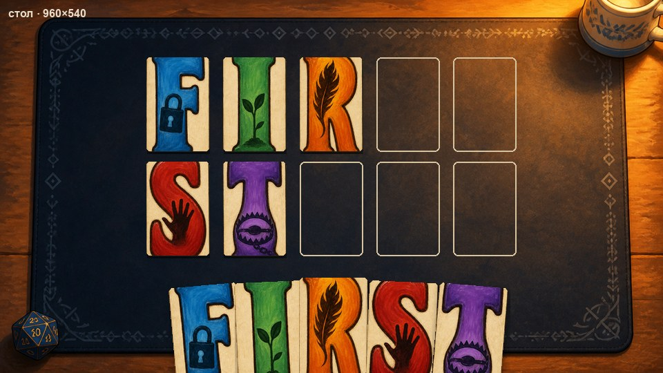 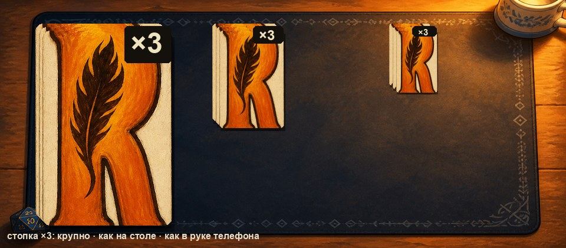

## C3 · Цветное лицо школы, кремовая буква
thesis: Всё лицо карты — цвет школы, буква кремовая с тенью, эмблема кремовая внизу.
note: Школа узнаётся мгновенно даже по краю карты в стопке — это плюс для веера и стопок. Но буква на цвете читается хуже, чем цвет на кремовом (особенно светлые школы), а стол становится пёстрым: пять цветных пятен вместо спокойного коврика с кремовыми картами. Мои баллы: П1 1.5 · П5 1.

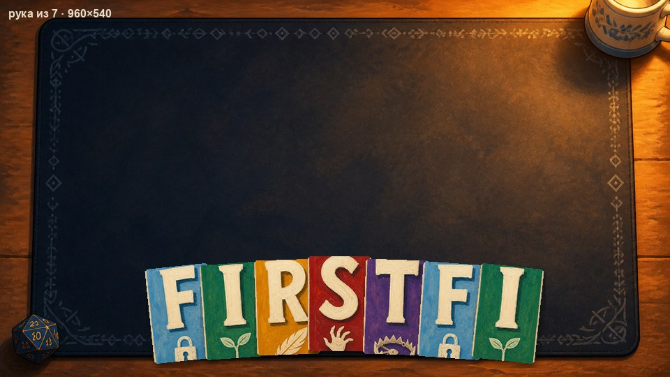 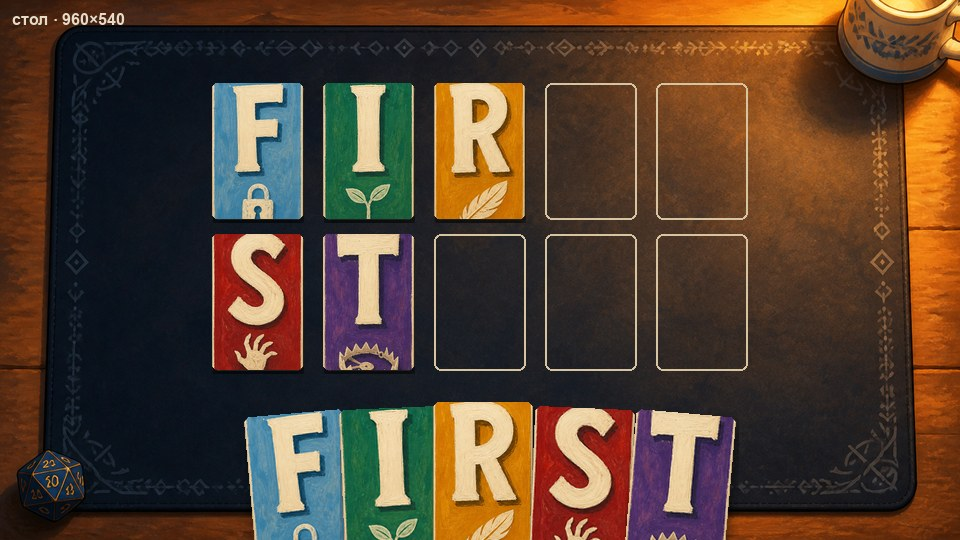 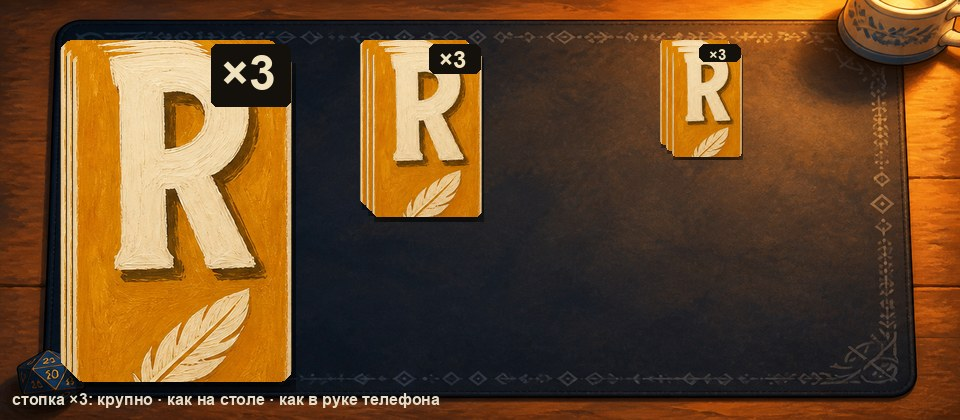

## C4 · Буква во всю карту + угловой индекс
thesis: Буква ~80 % высоты, цветная полоса сверху, маленький индекс буквы в углу для веера и стопок.
note: Модель не справилась с индексом (его нет), полоса срезалась при нарезке — идея угла для веера остаётся, но в таком виде вариант близок к C1 с буквой крупнее. Читаемость лучше C1, хуже C2. Мои баллы: П1 1.5 · П5 1.5.

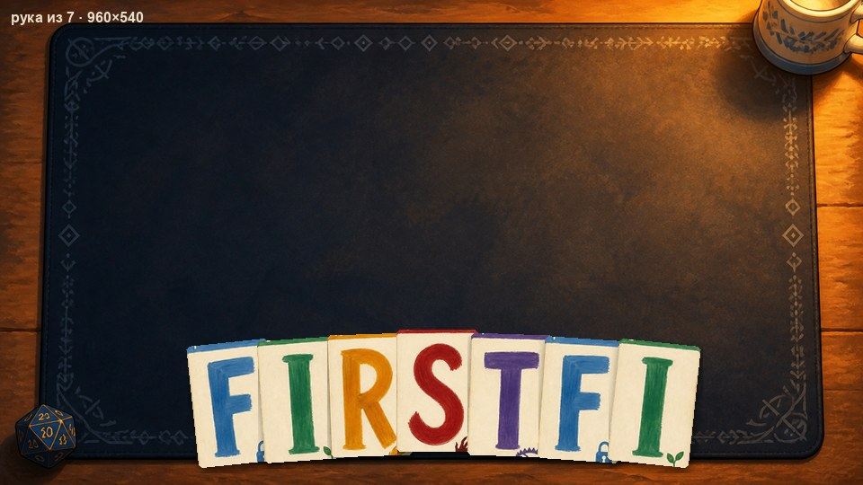 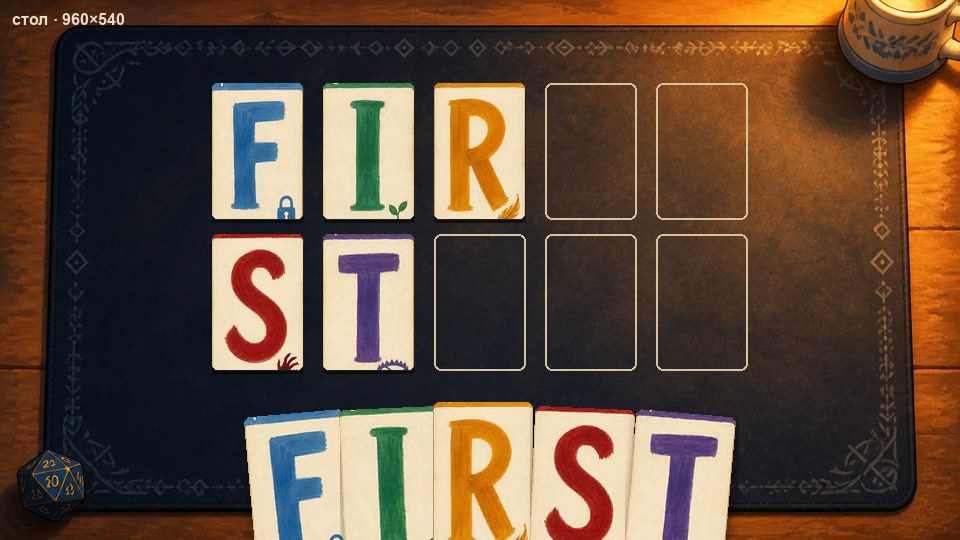 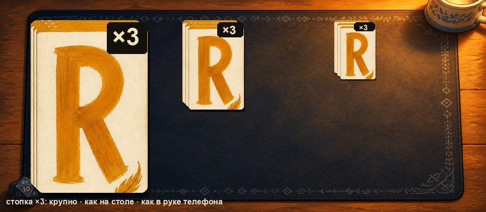

## outro
**Рекомендация арт-директора.** **C2**, смягчённый: тёмная обводка тоньше (чтобы не спорить с живописью), эмблема внутри буквы меньше и не ломает форму; кремовый картон и кант из C1. Если судье C2 кажется слишком громким — **C1 с более плотной, тёмной гуашью** (тот же силуэт, больше контраста) — это второй по читаемости.

**Что решает судья:** вариант (или гибрид: «силуэт и контраст C2, эмблема внизу как в C1»); «буквы запекаются в арт» — да/нет; и П1 0–2 по каждому варианту.

**Лист судьи**

| Вариант | П1 буква читается | П5 один мир | Нравится / отталкивает |
|---|---|---|---|
| C1 База | | | |
| C2 Обводка | | | |
| C3 Цветное лицо | | | |
| C4 Во всю карту | | | |
